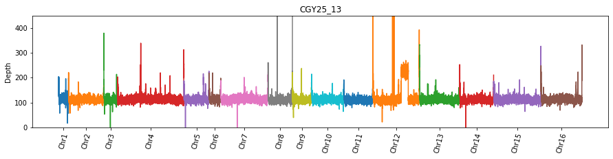

# Genomic sequencing pipeline

This a python tool used to simplify analysis of yeast sequencing data from the Calico Sequencing Core.

This was rough translation of [this wgs pipeline](https://github.com/nodice73/hspipeline).

## Running pipeline
```python
import os

import genomic_sequencing_pipeline as wgs

analysis_folder = '$SCRATCH/sequencing/200607_A01059_0016_BHJC3GDRXX'  # Folder to store data results
os.makedirs(analysis_folder, exist_ok=True)
sample_sheet_name = 'nemo-flow-cell-HJC3GDRXX-REQ1SUV_20200608_115729.csv'  # Sample sheet downloaded from nemo
bcl_dir = '/path/to/data/200607_A01059_0016_BHJC3GDRXX' # Location of BCL file on Calico NFS.

pipeline = wgs.Pipeline(
    analysis_folder,
    bcl_dir,
    sample_sheet_name
)
pipeline.email = 'your-email@calicolabs.com'
pipeline.NTHREAD = 4 # How many CPUS to use for most steps. 4 is a good number that balances performance and queue time


pipeline.demux(wait=False)
pipeline.align()
```

The above script, run from a VM/node on the cluster should submit several jobs through slurm that will demux and align your sequences.

Progress of these jobs can be monitored w/:
```bash
squeue -u $USER
```

## Analysis of rDNA/gc bias in samples
```python

rdna_report = wgs.rdna.rDNAReport(pipeline.wd, len(pipeline.sample_sheet_df))
gc_reporter = wgs.gc_content.GcReport(pipeline.wd, pipeline.sample_sheet_df)

gc = gc_reporter.generate()
rdna = rdna_report.generate()

pipeline.sample_sheet_df = pipeline.sample_sheet_df.merge(
    rdna,
    left_index=True,
    right_index=True,
    how='left'
)
pipeline.sample_sheet_df = pipeline.sample_sheet_df.merge(
    gc,
    left_index=True,
    right_index=True,
    how='left'
)

display(pipeline.sample_sheet_df)
```
### Correcting for GC-Bias
```python
def correct_coverage(args):
    coverage, gc_intercept,  gc_slope = args
    predicted_depth = gc_slope * 45 + gc_intercept
    return (coverage / predicted_depth) * 2

pipeline.sample_sheet_df = pipeline.sample_sheet_df.assign(
    rdna_copies_gc_adjusted=pipeline.sample_sheet_df[
        ['rdna_coverage', 'gc_intercept', 'gc_slope']
    ].apply(correct_coverage, axis=1)
)
display(pipeline.sample_sheet_df)
```

### Plotting of sample coverage (useful detecting large duplications)


```python
import matplotlib.pyplot as plt

for sample_number, row in pipeline.sample_sheet_df.iterrows():
    depth_report = wgs.rdna.open_depth_report(analysis_folder, sample_number)
    depth_report = depth_report[depth_report.chromosome != 'mitochondrion']
    wgs.gc_content.plot_coverage_distribution(depth_report)
    plt.title(f"{row.Sample_Name}")
    plt.show()
```

### Versions
```
:~$ sickle --version
sickle version 1.33
Copyright (c) 2011 The Regents of University of California, Davis Campus.
sickle is free software and comes with ABSOLUTELY NO WARRANTY.
Distributed under the MIT License.

Written by Nikhil Joshi, UC Davis Bioinformatics Core


:~$ bowtie2 --version
bowtie2/bowtie2-align-s version 2.3.5.1
64-bit
Built on
Wed Aug 14 20:38:48 UTC 2019
Compiler: gcc version 7.4.0 (Ubuntu 7.4.0-1ubuntu1~18.04.1)
Options: -O3 -m64 -msse2 -funroll-loops -g3 -std=c++98 -DPOPCNT_CAPABILITY -DWITH_TBB -DNO_SPINLOCK -DWITH_QUEUELOCK=1
Sizeof {int, long, long long, void*, size_t, off_t}: {4, 8, 8, 8, 8, 8}


:~$ samtools --version
samtools 1.9-114-g76e7ed6
Using htslib 1.9-293-g5e83884
Copyright (C) 2019 Genome Research Ltd.
```
